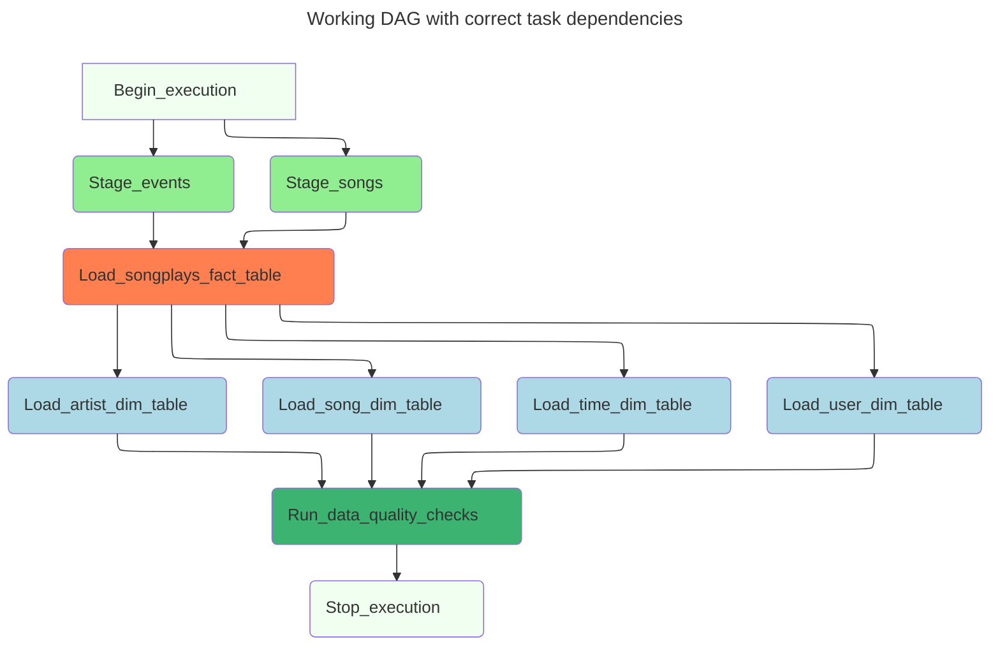

# Data Pipelines with Airflow

Welcome to the Data Pipelines with Airflow project! This endeavor will provide you with a solid understanding of Apache Airflow's core concepts. Your task involves creating custom operators to execute essential functions like staging data, populating a data warehouse, and validating data through the pipeline.

To begin, we've equipped you with a project template that streamlines imports and includes four unimplemented operators. These operators need your attention to turn them into functional components of a data pipeline. The template also outlines tasks that must be interconnected for a coherent and logical data flow.

A helper class containing all necessary SQL transformations is at your disposal. While you won't have to write the ETL processes, your responsibility lies in executing them using your custom operators.

## Initiating the Airflow Web Server
Ensure [Docker Desktop](https://www.docker.com/products/docker-desktop/) is installed before proceeding.

To bring up the entire app stack up, we use [docker-compose](https://docs.docker.com/engine/reference/commandline/compose_up/) as shown below

```bash
docker-compose up -d
```

Visit http://localhost:8080 once all containers are up and running.

## Configuring Connections in the Airflow Web Server UI

On the Airflow web server UI, use `airflow` for both username and password.

- Post-login, navigate to **Admin > Connections** to add required connections - specifically, `aws_credentials` and `redshift`.
- Don't forget to start your Redshift cluster via the AWS console.
- After completing these steps, run your DAG to ensure all tasks are successfully executed.

## Getting Started with the Project

1. The project template package comprises three key components:
   - The **DAG template** includes imports and task templates but lacks task dependencies.
   - The **operators** folder with operator templates.
   - A **helper class** for SQL transformations.

2. With these template files, you should see the new DAG in the Airflow UI, with a graph view resembling the screenshot below:

   ```mermaid
   ---
   title: The project DAG in the Airflow UI
   config:
     look: classic
     theme: classic
     flowchart:
       useMaxWidth: true
       defaultRenderer: "elk"
   ---

   flowchart TB
       A("Begin_execution&nbsp;&nbsp;&nbsp;&nbsp;&nbsp;&nbsp;")
       B(Load_artist_dim_table&nbsp;&nbsp;&nbsp;&nbsp;&nbsp;)
       C(Load_song_dim_table&nbsp;&nbsp;&nbsp;&nbsp;&nbsp;)
       D(Load_songplays_fact_table&nbsp;&nbsp;&nbsp;&nbsp;&nbsp;&nbsp;&nbsp;&nbsp;)
       E(Load_time_dim_table&nbsp;&nbsp;&nbsp;&nbsp;&nbsp;)
       F(Load_user_dim_table&nbsp;&nbsp;&nbsp;&nbsp;&nbsp;)
       G(Run_data_quality_checks&nbsp;&nbsp;&nbsp;&nbsp;&nbsp;&nbsp;)
       H(Stage_events&nbsp;&nbsp;&nbsp;&nbsp;&nbsp;&nbsp;)
       I(Stage_songs&nbsp;&nbsp;&nbsp;&nbsp;&nbsp;)

       A ~~~ B ~~~ C ~~~ D ~~~ E ~~~ F ~~~ G ~~~ H ~~~ I

       style A fill:azure
       style B fill:tan
       style C fill:tan
       style D fill:orange
       style E fill:tan
       style F fill:tan
       style G fill:lime
       style H fill:salmon
       style I fill:salmon
   ```

You should be able to execute the DAG successfully, but if you check the logs, you will see only `operator not implemented` messages.

## DAG Configuration

In the DAG, add `default parameters` based on these guidelines:

- No dependencies on past runs.
- Tasks are retried three times on failure.
- Retries occur every five minutes.
- Catchup is turned off.
- No email on retry.

Additionally, configure task dependencies to match the flow depicted in the image below:



## Developing Operators

To complete the project, build four operators for staging data, transforming data, and performing data quality checks. While you can reuse code from Project 2, leverage Airflow's built-in functionalities like connections and hooks whenever possible to let Airflow handle the heavy lifting.

### Stage Operator

Load any JSON-formatted files from S3 to Amazon Redshift using the stage operator. The operator should create and run a SQL COPY statement based on provided parameters, distinguishing between JSON files. It should also support loading timestamped files from S3 based on execution time for backfills.

### Fact and Dimension Operators

Utilize the provided SQL helper class for data transformations. These operators take a SQL statement, target database, and optional target table as input. For dimension loads, implement the truncate-insert pattern, allowing for switching between insert modes. Fact tables should support append-only functionality.

### Data Quality Operator

Create the data quality operator to run checks on the data using SQL-based test cases and expected results. The operator should raise an exception and initiate task retry and eventual failure if test results don't match expectations.

## Reviewing Starter Code

Before diving into development, familiarize yourself with the following files:
- [plugins/operators/data_quality.py](plugins/operators/data_quality.py)
- [plugins/operators/load_fact.py](plugins/operators/load_fact.py)
- [plugins/operators/load_dimension.py](plugins/operators/load_dimension.py)
- [plugins/operators/stage_redshift.py](plugins/operators/stage_redshift.py)
- [plugins/helpers/sql_queries.py](plugins/helpers/sql_queries.py)
- [dags/final_project.py](dags/final_project.py)

Now you're ready to embark on this exciting journey into the world of Data Pipelines with Airflow!
